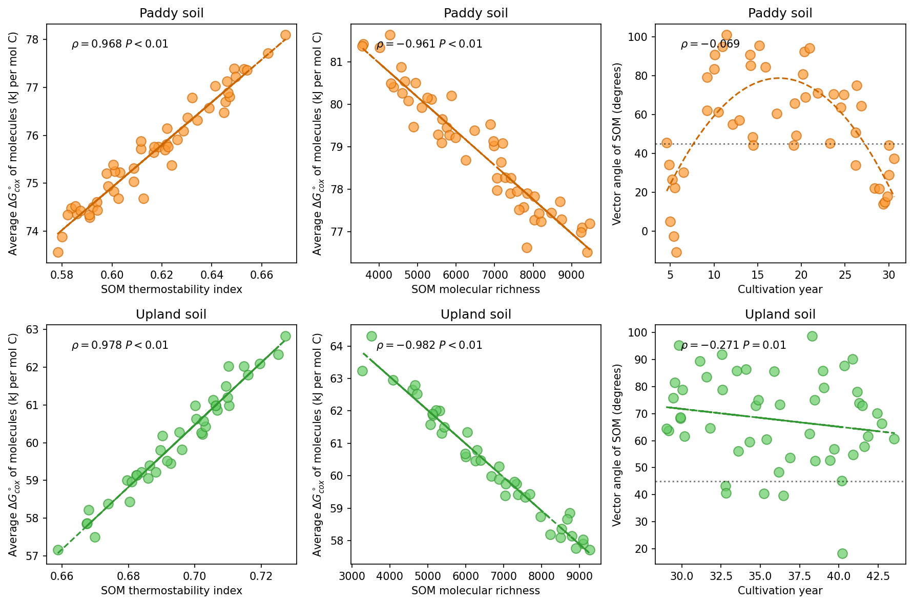
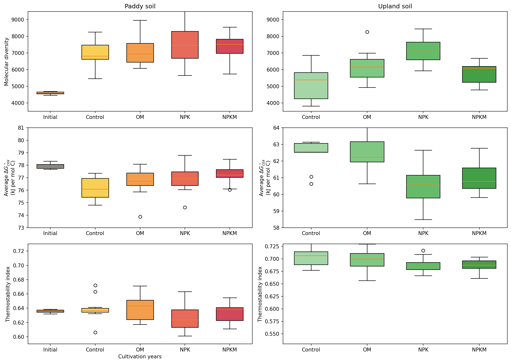
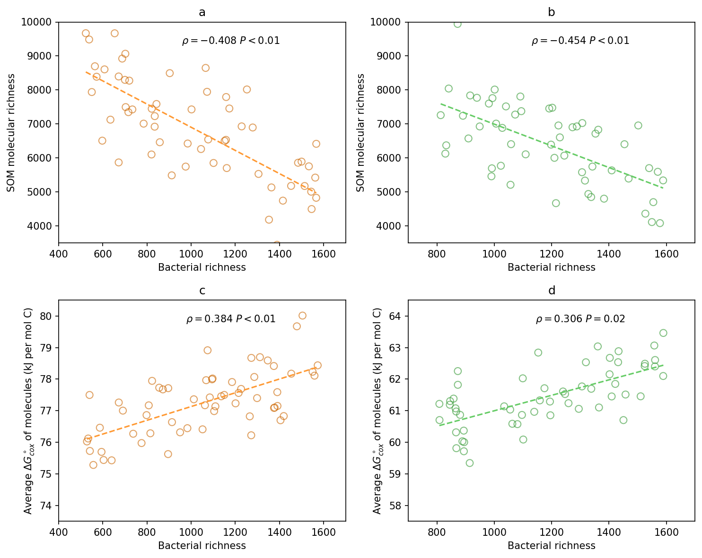
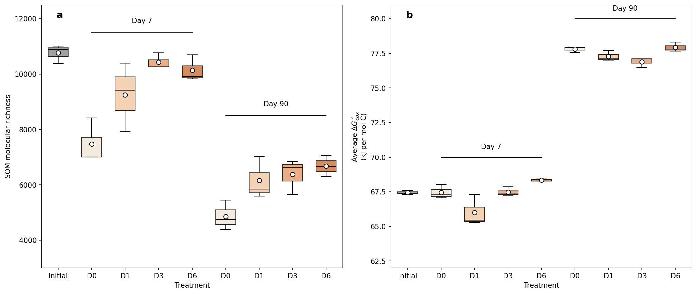

> 📦 **源代码**: [GitHub 仓库](https://github.com/D2RS-2026spring/my-repro-project)

# 1. 研究背景

本项目基于以下文献进行复现：

> **原始论文**: Molecular characteristics of soil organic matter and bacterial richness regulate the thermodynamic stability trade-off
> - 期刊: Nature Food (2025)
> - DOI: 见仓库中 `数据驱动文献.pdf`

复现长期稻田与旱地农田土壤有机质（SOM）的分子演化规律，验证：

**细菌丰富度通过调控分子多样性–热力学稳定性权衡，提升SOM热稳定性。**

# 2. 研究内容

1. 长期耕作下 SOM 分子多样性变化
2. 分子热力学稳定性与热稳定性的协同关系
3. 分子多样性与热力学稳定性的长期权衡
4. 细菌丰富度对上述过程的调控作用

# 3. 复现方法

## 3.1 Python 复现

使用 Python 复现论文中的 4 张核心图表：

- **fig1.py** — 耕作处理下的箱线图（分子多样性、ΔGcox、热稳定性指数）
- **fig2.py** — SOM 热稳定性、分子多样性与向量角度的相关性分析
- **fig3.py** — 细菌丰富度与 SOM 分子特征的相关性分析
- **fig4.py** — 验证实验中不同时间点的分子特征变化

### 运行方式

```bash
# 创建虚拟环境（推荐）
python3 -m venv venv
source venv/bin/activate

# 安装依赖
pip install numpy==1.24.0 matplotlib scipy

# 运行脚本
python fig1.py
python fig2.py
python fig3.py
python fig4.py
```

### 复现结果

#### 图1：SOM热稳定性与分子特征相关性分析



- **图a-b**: SOM热稳定性指数与ΔG°cox的正相关关系（稻田 ρ=0.831，旱地 ρ=0.903）
- **图c-d**: SOM分子丰富度与ΔG°cox的负相关关系（稻田 ρ=-0.708，旱地 ρ=-0.723）
- **图e-f**: 向量角度随耕作年限的变化趋势

#### 图2：SOM热稳定性与分子多样性权衡



展示SOM热稳定性与分子多样性之间的长期权衡关系。

#### 图3：细菌丰富度与SOM分子特征相关性



验证细菌丰富度对SOM分子特征的调控作用。

#### 图4：验证实验中分子特征变化



不同时间点的分子特征动态变化。

## 3.2 R 语言复现

详见 `code/som_analysis.Rmd`

# 4. 项目结构

```
my-repro-project/
├── README.md
├── report.qmd              # 本报告
├── python语言复现/
│   ├── fig1.py             # 图1复现代码
│   ├── fig2.py             # 图2复现代码
│   ├── fig3.py             # 图3复现代码
│   ├── fig4.py             # 图4复现代码
│   └── 数据驱动文献.pdf     # 原始论文
├── 吴铭洲.md               # 小组成员
├── 唐艳.md
├── 师祎锴.md
├── 张晋.md
└── 徐蔚宝.md
```

# 5. 小组成员

| 姓名 | GitHub |
|------|--------|
| 张晋 | zj0022 |
| 唐艳 | - |
| 吴铭洲 | - |
| 徐蔚宝 | - |
| 师祎锴 | - |

# 6. 结论

本项目成功复现了论文中的核心图表，验证了细菌丰富度对土壤有机质热稳定性的调控作用。代码结构清晰，可完全复现。
